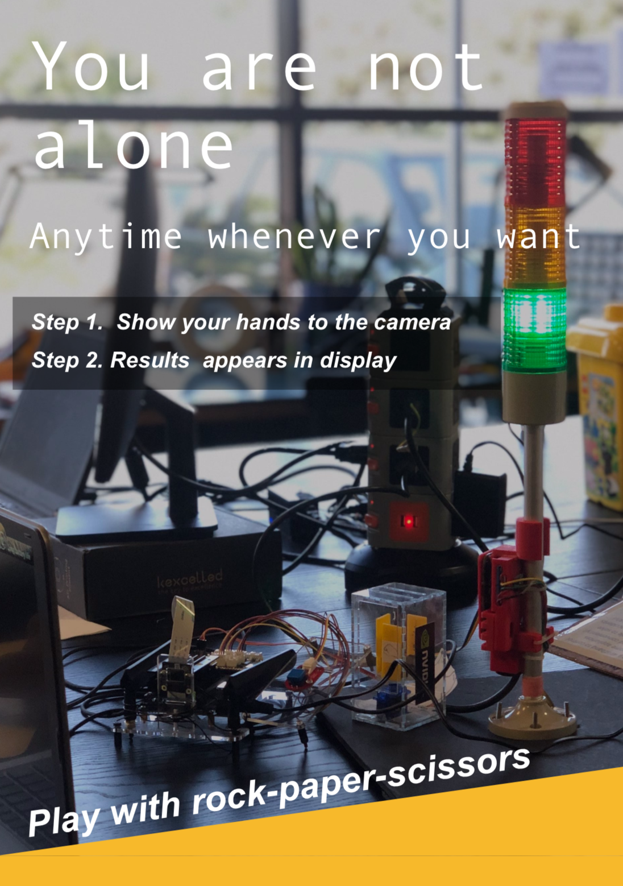
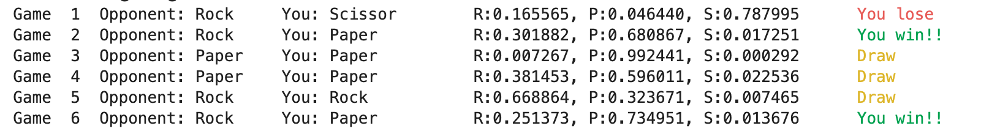
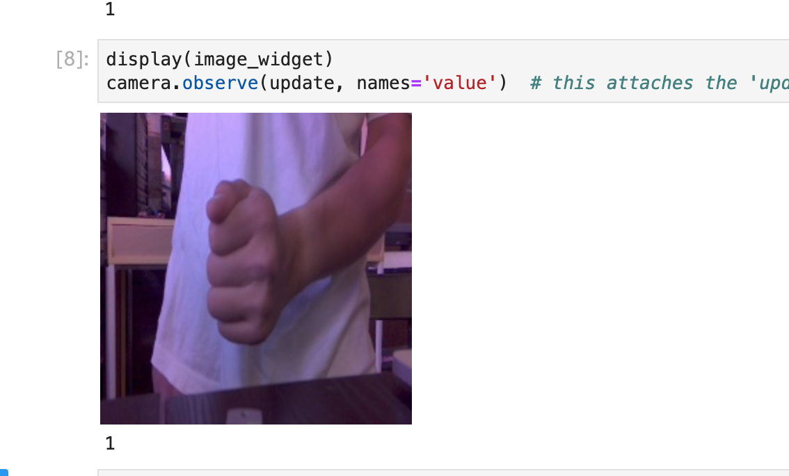
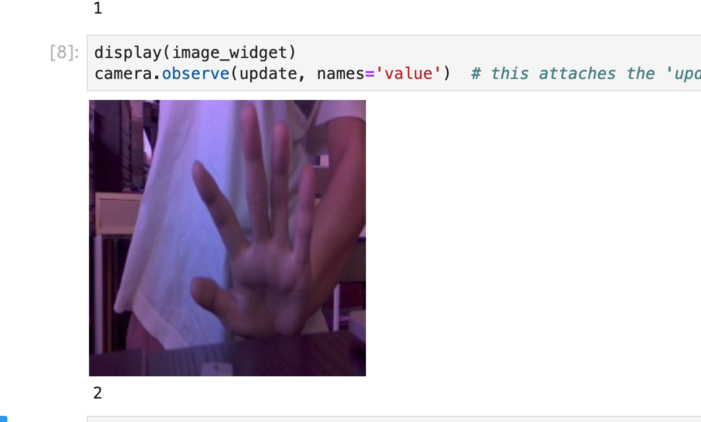
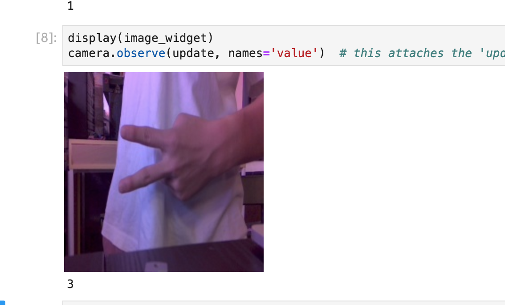

# Rock-Paper-Scissors with Jetson Nano


You can try to play the **Rock-Paper-Scissors game with a Jetson Nano**! 

## Setup Guide

### Step 1 - Flash JetBot image onto SD card
1.  Download the expandable JetBot SD card image `jetbot_image_xxxxxx.zip`
     > For the JetBot SD card image, see the link here: https://github.com/NVIDIA-AI-IOT/jetbot/wiki/software-setup
     
2.  Insert an SD card into your desktop machine
3.  Using [Etcher](https://www.balena.io/etcher/), select the `jetbot_image_xxxxxx.zip` image and flash it onto the SD card
4.  Remove the SD card from your desktop machine

### Step 2 - Connect to JetBot from web browser
1. Do not plug in your HDMI monitor, USB keyboard, mouse for the Jetson Nano
2. Put the SD card prepared in the last section into the Jetson Nano.

3. Plug in the camera module to Jetson Nano.

4. Connection Jetson Nano to your desktop through micro-USB. 
	
    
5. Power the JetBot by plugging in the power supply. 
6. Wait a bit for JetBot to boot.
     After booting, the IP addresses will be as follows: 
	JetBot: `192.168.55.1`
	PC: `192.168.55.100`
    
7. Navigate to `http://192.168.55.1:8888` from your desktop's web browser

8. Enter `jetbot` as the password to log into Jupyter.

### Step 3 - Connect to Wi-Fi
1. Open a new terminal page in Jupyter.

2. Show the list of available networks.
```
nmcli device wifi list
```

3. Connect to the network
```
sudo nmcli device wifi connect '<SSID>' password '<PASSWORD>' ifname wlan0
```
4. Check the IP address of Jetson Nano
```
ifconfig -a
```

### Step 4 - Install dependencies
#### jetcam
```
git clone https://github.com/NVIDIA-AI-IOT/jetcam.git
cd jetcam
sudo python3 setup.py install
```
#### colorama (For colored text output)
```
pip3 install colorama
```
### Step 5 - Set up the Project and Play! (Using precollected data)
1. Clone the project
```
cd ~
git clone https://github.com/mokpi/Rock-Paper-Scissors-with-Jetson-Nano.git
```

2. Open `train_model.ipynb` and run all the cells in order. 
    - You will obtain the file `best_model.pth` after the notebook is completely run, this file will be used as the model to recognize hand gestures. 
    - If the last cell produce 30 lines of output, then the cell is completely run. 
    - First time running cell #5 may cause the program to download the pretrained model of alexnet from pytorch.com (around 233MB)
    - You don't need to do this process every time, after you have already obtained the model.
	
3. Open `test_game.ipynb` and run all the cells in order. 
    You can play the Rock-Paper-Scissors game after you run the last cell. 
    

## Purpose of each of the Files and Folders

### `collection.ipynb`
Data collection for the rock-paper-scissor hand gestures.

This is the first stage of the project. 

### `train_model.ipynb`
Train the model with the data collected.

This is the second stage of the project. 

### `test_game.ipynb`
Code for testing gameplay process. This code is a simplified version of `game.ipynb`, the GPIO part indicating the device's choice of Rock/Paper/Scissor is removed. 

Try running this file before `game.ipynb` when you clone this project.

### `game.ipynb`
Code for actual gameplay process, including GPIO lights and buttons. 

During the gameplay, the trained model is used to recognize the hand gesture of the player.

This is the final stage of the project. 

### Folders inside `dataset`
>| Category (Folder Name) | Meaning |
>|--|--|
>| one | Rock |
>| two | Paper |
>| three | Scissor |

This folders contain the images used to train the network.

### `development_codes`
This folder contains testing codes in the development phase.


## Enhancing Recognition Results
### (For now)
If you want to get good hand gesture recognition results, the following poses are recommended.

| Gesture | Poses |
|--|--|
| Rock |  |
| Paper|  |
| Scissors|  |


### Further development

1. Collecting more data to train the network would certainly improve
    the accuracy of the network. 
    - different environments and lighting
    - different colors
    - use a better camera
2. We use Alexnet for the recognition. Choosing a more suited network may help.
